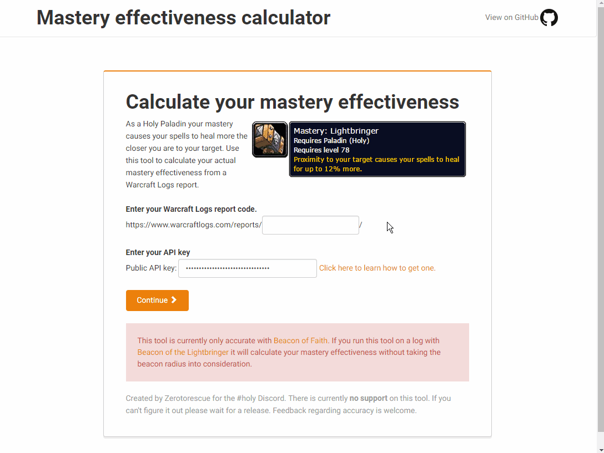
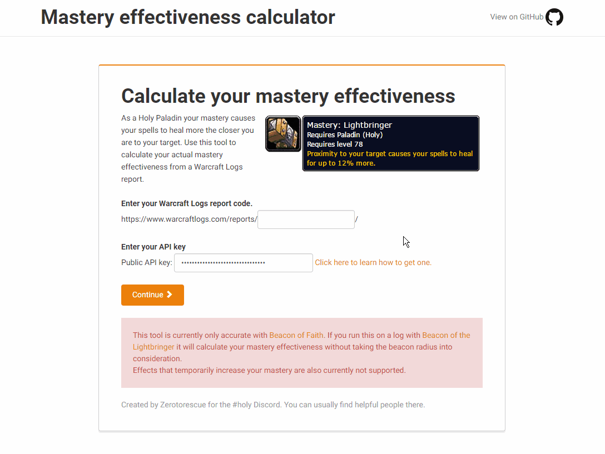
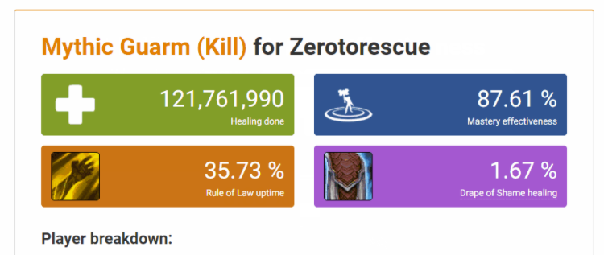
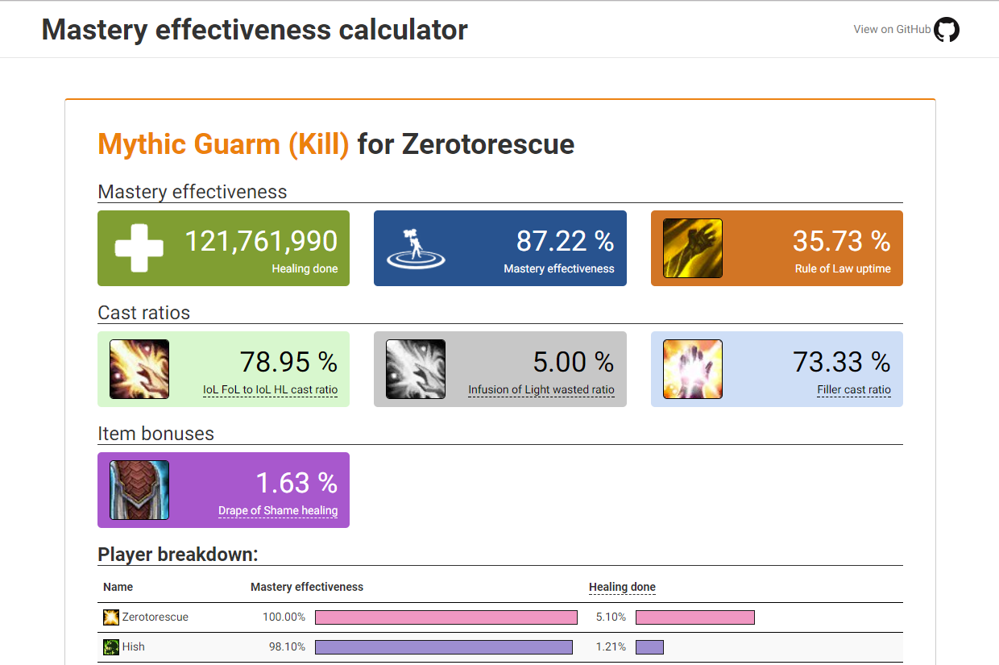
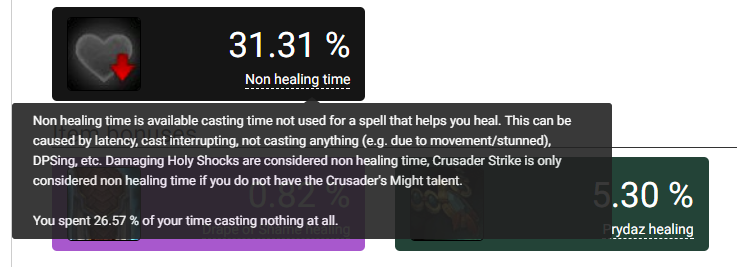
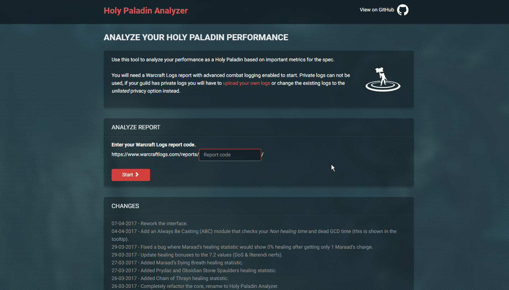
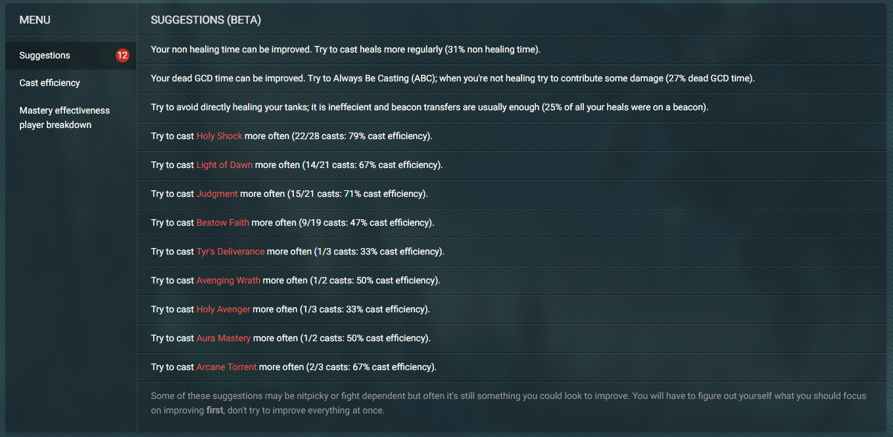
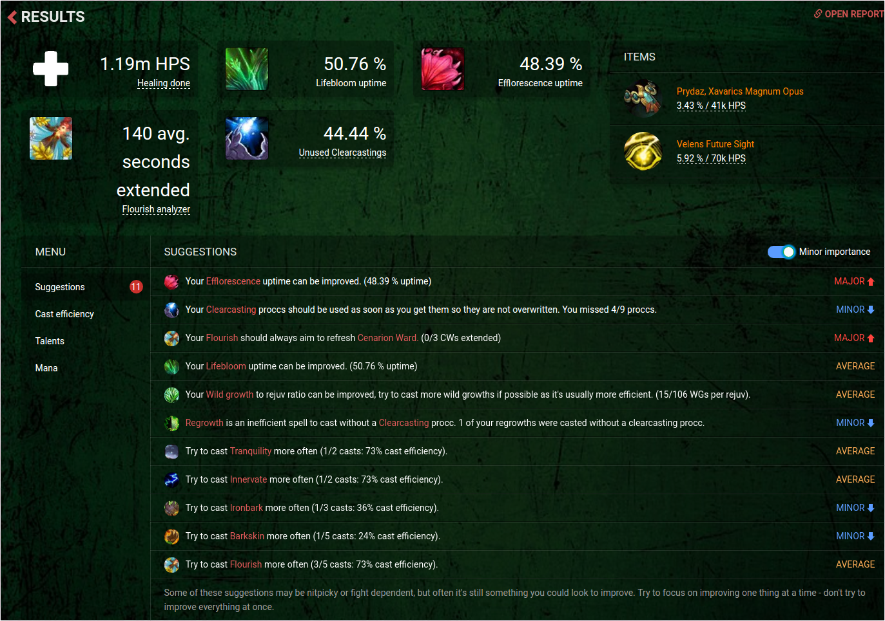
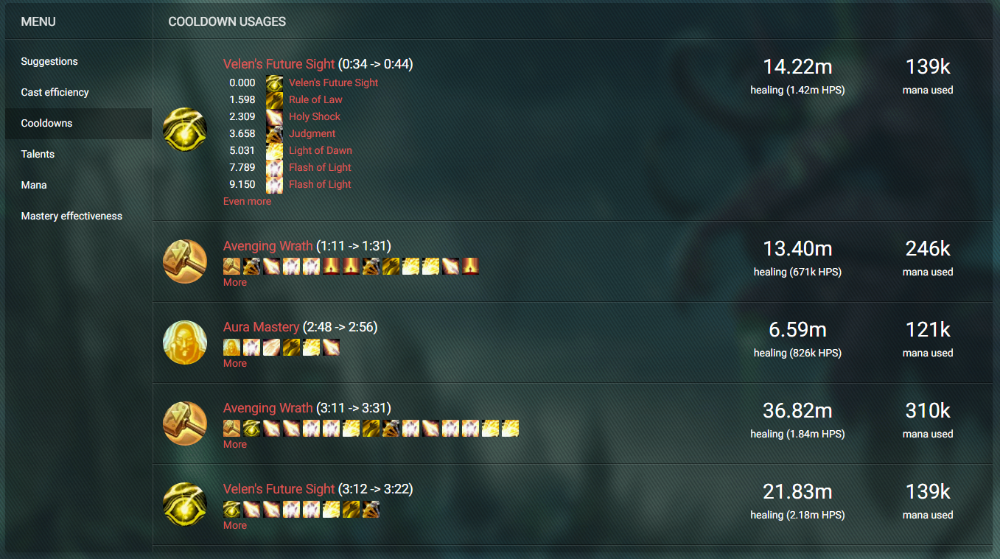
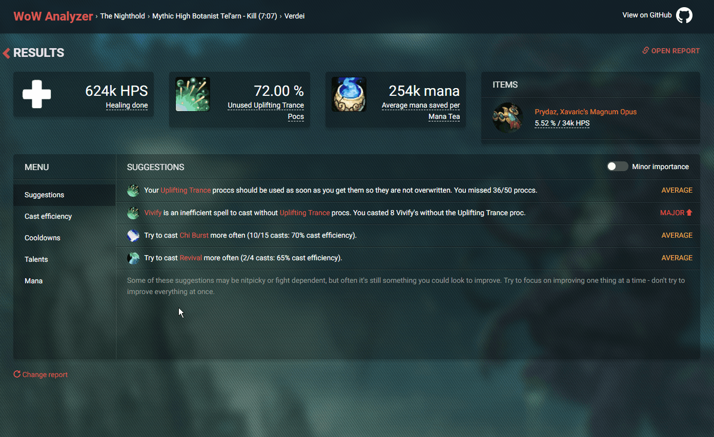

# WoWAnalyzer's first anniversary

# This is a concept right now, it needs a lot more work. It probably goes too much into detail in some areas, and is missing some other things. Any feedback and help writing would be much appreciated!

It has already been a year! Time flies when you're working hard. We want to use this milestone to recap everything that has happened during this past year.

## Project progress

2017 meant the inception of WoWAnalyzer. I (Zerotorescue) created it out of the need to do more complex analysis that would not have be possible with a simple spreadsheet. There were a bunch of spreadsheets to analyze the many different things relevant for Holy Paladins but one very important metric, Mastery Effectiveness, proofed too complex to be calculated this way. After a night of going through Warcraft Logs' replay function to estimate my own Mastery Effectiveness, I realized that it must have access to a player's location in order to provide the replay functionality. After a lot of figuring out I got a proof of concept working, which became the [first commit](https://github.com/WoWAnalyzer/WoWAnalyzer/commit/bd7971995fe16d14aec7286765c13c2984c44d76) at **31 Jan 2017 00:02 CET**. The project was called the "Holy Paladin mastery effectiveness calculator" at the time because that was all it did. It offered us the first reliable way to accurately determine a Holy Paladin's mastery effectiveness. The Holy Paladin community was very excited about this.

Holy Paladin mastery effectiveness calculator v0.0.1 at 31 Jan 2017. Do note that at the time WCL throttled the events API to 300 events per API call, so loading a fight took considerably longer back then.

As the project was getting a lot of attention in the Holy Paladin community, the layout was cleaned up a bit.

Holy Paladin mastery effectiveness calculator v0.1.0 at 3 Feb 2017

This was cleaned up further, and a player breakdown was added. The theme for the layout remained similar for a couple of months.

Holy Paladin mastery effectiveness calculator v0.2.0 at 4 Feb 2017

I quickly went through a lot of minor versions during this month. I removed the need for users to enter their own WCL API key, added URL routing (so you can directly link to a log) and added a [Rule of Law](http://www.wowhead.com/spell=214202/rule-of-law) uptime display (which improves a Holy Paladin's mastery effectiveness so was related) among other things. In March I added a statistic not related to a Holy Paladin's mastery effectiveness; the [Drape of Shame](http://www.wowhead.com/item=142170/drape-of-shame) healing contribution statistic. For the first time this gave us insight into the exact healing contribution of Drape of Shame.

Holy Paladin mastery effectiveness calculator v0.3.1 statistics at 18 Mar 2017

With the majority of the work done, I quickly added statistics for the legendaries Ilterendi, Crown Jewel of Silvermoon and Velen's Future Sight in the following few days. Next I added statistics important to filling in the Holy Paladin stat weights spreadsheet: cast behavior.

Holy Paladin mastery effectiveness calculator v0.9 at 25 Mar 2017

At 26 Mar 2017 I did a big rewrite of the code in place to make it modular, making it easier to maintain and extend. This modular approach is still in place today. Accompanying this big rewrite was a name change and a version bump to **Holy Paladin Analyzer v1.0**. I spent a few days adding more interesting item statistics; Chain of Thrayn, Prydaz, Obsidian Stone Spaulders and Maraad's Dying Breath before getting to the first version of the downtime statistic ("Always Be Casting").

Holy Paladin Analyzer v1.4.1: new downtime statistic at 4 Apr 2017

By this time I felt we needed a new layout. Inspired by [Blur Admin](http://akveo.com/blur-admin/#/dashboard) I designed a new layout that was the basis for what we have today (disclaimer: I'm not a graphic designer).

Holy Paladin Analyzer v2.0: a new look at 7 Apr 2017

Because cast efficiency is very important for a Holy Paladin's performance I added a Cast Efficiency panel showing the actual casts and an estimated max possible casts. The *Can be improved.* indicator in this panel was the first step towards showing gameplay suggestings. I had been thinking about doing *suggestions* for a long time at this point.

Holy Paladin Analyzer v2.4: cast efficiency at 11 Apr 2017

With cast efficiency implemented, the Holy Paladin Analyzer now calculated most of the important metrics for Holy Paladins. This meant I could finally implement the *suggestions* panel I wanted to do. The first version looked like this:

Holy Paladin Analyzer v3.0: suggestions! at 14 Apr 2017

I continued to add analysis for items, talents, traits and other metrics to the Holy Paladin Analyzer, and improved existing features. At the same time I rewrote a large part of the codebase to greatly improve the existing code for better extensibility and maintainability. For myself, and to make it easier for anyone else to contribute and maybe even make a version for their own spec.

At 31 March 2017 **@Josh** contacted me about putting the code under an open license so that he could use parts for Disc Priest analysis. This led to a license that allows usage in non-commercial open source projects which was later replaced with the more formal [AGPL](https://github.com/WoWAnalyzer/WoWAnalyzer/blob/master/LICENSE) license.

At 6 May 2016 **@blazyb** reached out about creating an analyzer for *Restoration Druids*. His feedback during this process helped a lot to rewrite even more of the codebase to make it easier for others to work with and to make it more natural to implement different specs. After talking with blazyb a lot about the future of the project I decided that the best approach would be to launch a single website for multiple specs with it selecting the spec analyzer needed.

At 11 May 2017 I purchased the **WoWAnalyzer.com** domain. By 13 May 2017 I had finished implementing support for multiple spec analyzers in one project. The project was rebranded to WoWAnalyzer and wowanalyzer.com was officially launched at 13 May 2017.

WoWAnalyzer v1.0 at 13 May 2017

Meanwhile blazyb worked on the **Resto Druid Analyzer** with an extensive private beta test. The Resto Druid Analyzer was publicly released at 15 May 2017. Due to the amount of work moving it into the shared project it was initially released as a standalone "fork". The Resto Druid Analyzer was fully merged into WoWAnalyzer at 21 May 2017.

Resto Druid Analyzer v1.0 at 15 May 2017

In order to continue growing the project and experience adding a new spec myself (after all the changes) and refine any rough edges I would run into, I started working on adding support for **Discipline Priest**. The first version of the Discipline Priest was added at 14 May 2017 and further extended in the next days and weeks. I had a lot of help from Josh while doing this.

WoWAnalyzer v1.0.9: Discipline Priest at 19 May 2017

We received our [first Pull Request](https://github.com/WoWAnalyzer/WoWAnalyzer/pull/22) from **@Reglitch** at 19 May 2017. In it he contributed an "editorconfig" file: `Fairly self explanatory, enforces consistency when multiple devs are working on the project.`. It was merged a day later.

I added the **Cooldowns** tab at 21 May 2017 to give more insight into cooldown usages, spells cast during them and throughput as a result.

WoWAnalyzer v1.1 at 21 May 2017

**Mistweaver Monk** support was [first proposed](https://github.com/WoWAnalyzer/WoWAnalyzer/pull/33) by **@Anomoly** at 23 May 2017, and merged to WoWAnalyzer.com after a short review process a day later.

WoWAnalyzer v1.1.1: initial Mistweaver support at 25 May 2017

TODO: Go through all 850 PRs to mention everyone that ever contributed anything ever (after first mention only noteworthy contributions)

## Contributors

## User growth

## 2018
