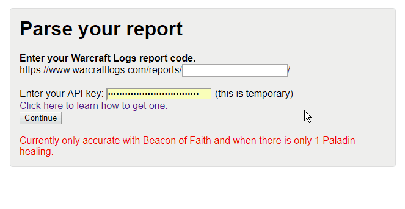
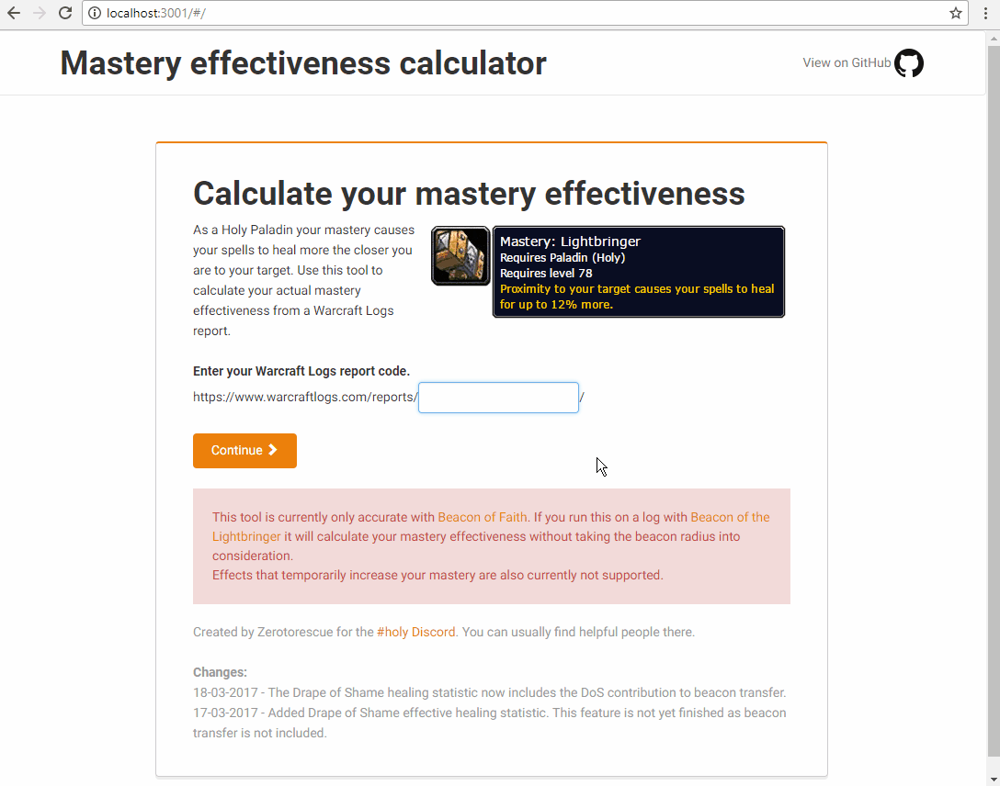
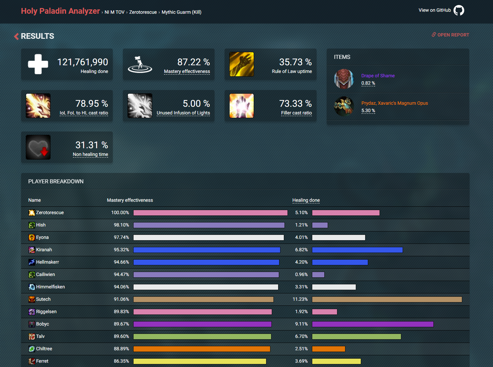

# Happy New Year! 2017 in review
or
# WoWAnalyzer's first anniversary

2017 has come to a close and we want to use this opportunity to recap everything that has happened during this past year.

## Project progress

2017 meant the inception of WoWAnalyzer. It was created out of the need to do more complex analysis that would not have be possible with a simple spreadsheet. There were a bunch of spreadsheets to analyze the many different things relevant for Holy Paladins but one very important metric, Mastery Effectiveness, proofed too complex to be calculated this way. After a night of going through Warcraft Logs' replay function to estimate my own Mastery Effectiveness I realized that it must have access to a player's location in order to provide the replay functionality. After a lot of figuring out I got a proof of concept working, which became the [first commit](https://github.com/WoWAnalyzer/WoWAnalyzer/commit/bd7971995fe16d14aec7286765c13c2984c44d76) at **31 Jan 2017 00:02 CET**. The project was called the "Holy Paladin mastery effectiveness calculator" at the time because that was all it did. It offered us the first reliable way to accurately determine a Holy Paladin's mastery effectiveness. The Holy Paladin community was very excited about this.

Holy Paladin mastery effectiveness calculator v0.0.1 at 31 Jan 2017

As the project was getting a lot of attention in the Holy Paladin community, the layout was cleaned up a bit.

Holy Paladin mastery effectiveness calculator v0.1.0 at 3 Feb 2017

This was cleaned up further, and a player breakdown was added. The theme for the layout remained similar for a couple of months.

Holy Paladin mastery effectiveness calculator v0.2.0 at 4 Feb 2017

I quickly went through a lot of minor versions during this month. I removed the need for users to enter their own WCL API key, added URL routing (so you can directly link to a log) and added a [Rule of Law](http://www.wowhead.com/spell=214202/rule-of-law) uptime display (which improves a Holy Paladin's mastery effectiveness so was related) among other things. In March I added a statistic not related to a Holy Paladin's mastery effectiveness; the [Drape of Shame](http://www.wowhead.com/item=142170/drape-of-shame) healing contribution statistic. For the first time this gave us insight into the exact healing contribution of Drape of Shame.

Holy Paladin mastery effectiveness calculator v0.3.1 at 18 Mar 2017

With the majority of the work done, I quickly added statistics for the legendaries Ilterendi, Crown Jewel of Silvermoon and Velen's Future Sight in the following few days. Next I added statistics important to filling in the Holy Paladin stat weights spreadsheet: cast behavior.

Holy Paladin mastery effectiveness calculator v0.9 at 25 Mar 2017

At 26 Mar 2017 I did a big rewrite of the code in place to make it modular, making it easier to maintain and extend. This modular approach is still in place today. Accompanying this big rewrite was a name change and a version bump to **Holy Paladin Analyzer v1.0**. I spent a few days adding more interesting item statistics; Chain of Thrayn, Prydaz, Obsidian Stone Spaulders and Maraad's Dying Breath before getting to the first version of the downtime statistic ("Always Be Casting").

Holy Paladin Analyzer v1.4.1: new downtime statistic at 4 Apr 2017

By this time I felt it was time to get a more final layout. Inspired by [Blur Admin](http://akveo.com/blur-admin/#/dashboard) I designed a new layout that was the basis for what we have today (disclaimer: I'm not a graphic designer).

Holy Paladin Analyzer v2.0.0: a new look at 7 Mar 2017

## Contributors

## User growth

## More to come
